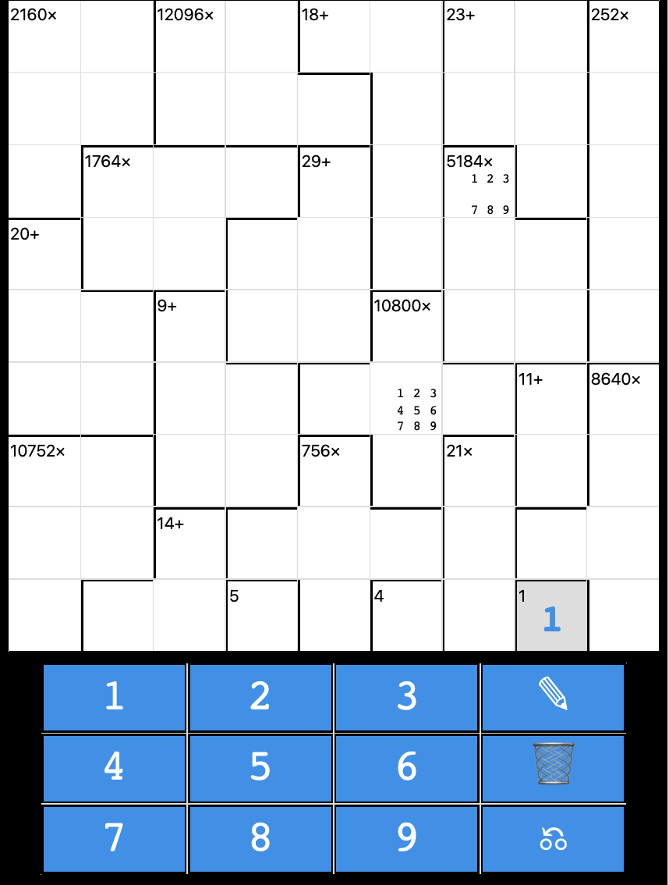

# MathDoku
A Progressive WebApp (PWA) implementing the late MathDoku game.

## Installation
None required. Just go to [the website](https://magnusm.uber.space/mathdoku/) and play.
- You __can__ install it as an app on Android. Open the URL in Chrome on Android, and from the dot menu, chose "Install app". It will be installed like a "normal" application, and not have URL bars etc.
- Apple: Status unknown, please test
- Other mobile: Status unknown, please test

## Screenshot
